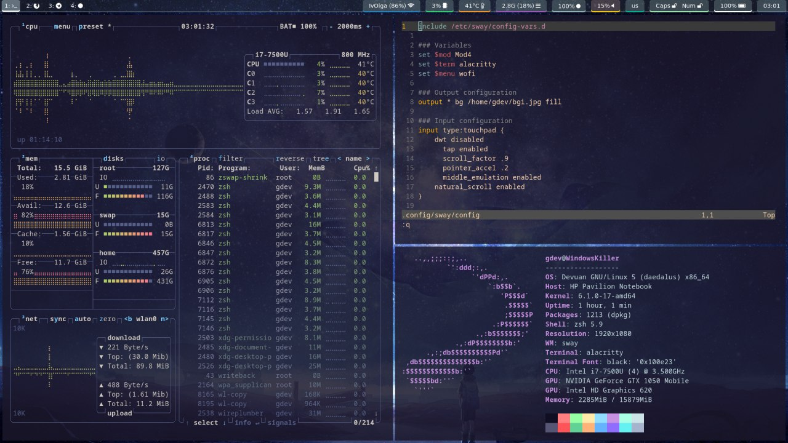

# dotfiles
Configs that I use on my device

## My system
- **Distro:** [Devuan Linux](https://www.devuan.org/) (daedalus)
- I hate X11 and use [Wayland](https://wayland.freedesktop.org/)
- **Multimedia Server:** [PipeWire](https://github.com/PipeWire/pipewire)

## Utilities
- **Login Manager:** tty (simple and stable)
- **Window Manager:** [Sway](https://github.com/swaywm/sway)
- **Status Bar:** [Waybar](https://github.com/Alexays/Waybar)
- **Idle Screen:** [Swaylock](https://github.com/swaywm/swaylock) ([swaylock-fancy](https://github.com/Big-B/swaylock-fancy))
- **Application Launcher:** [Wofi](https://hg.sr.ht/~scoopta/wofi)
- **Terminal:** [Alacritty](https://github.com/alacritty/alacritty)
- **Shell:** [ZSH](https://www.zsh.org/) ([oh-my-zsh](https://github.com/ohmyzsh/ohmyzsh/))

## CLI Utilities
- **Editor:** [NeoVim](https://github.com/neovim/neovim)
- **Sound:** [WirePlumber](https://github.com/PipeWire/wireplumber)
- **Brightness:** [brightnessctl](https://github.com/Hummer12007/brightnessctl)

